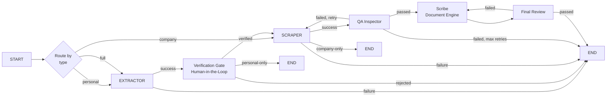
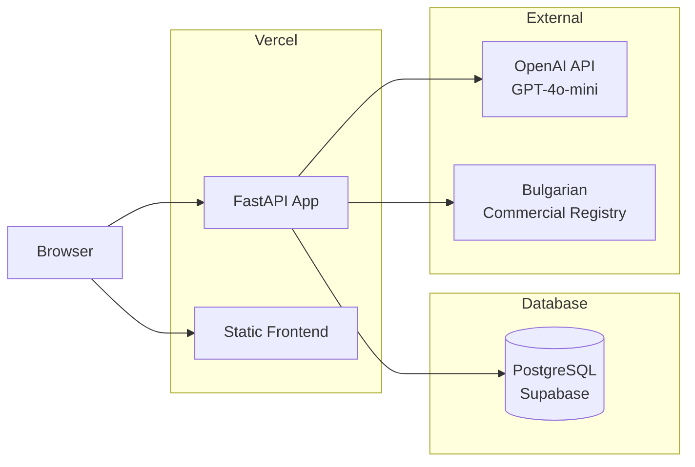

# Architecture Overview

> **System design, layer architecture, and data flow of the AutoMate multi-agent pipeline.**

---

## System Architecture

AutoMate follows a **layered architecture** with clear separation of concerns:

```
┌─────────────────────────────────────────────────────────┐
│                     Frontend Layer                       │
│           Vanilla HTML/CSS/JS (Single Page App)         │
│                                                         │
│   Personal Extraction  │  Company Lookup  │  Documents  │
└────────────────────────┼────────────────────────────────┘
                         │  REST API (JSON)
                         ▼
┌─────────────────────────────────────────────────────────┐
│                      API Layer                           │
│                     FastAPI Router                       │
│                    /api/v1/*                             │
│                                                         │
│   Process Endpoints  │  Document Endpoints  │  Admin    │
└─────────────────────────────┬───────────────────────────┘
                              │
                              ▼
┌─────────────────────────────────────────────────────────┐
│                  Orchestration Layer                     │
│              LangGraph StateGraph                        │
│                                                         │
│   ┌──────────┐  ┌──────┐  ┌────────┐  ┌──────┐         │
│   │Extractor │→│Verif.│→│Scraper│→│QA   │→...│         │
│   └──────────┘  └──────┘  └────────┘  └──────┘         │
└───────────────────┬─────────────────────────────────────┘
                    │
                    ▼
┌─────────────────────────────────────────────────────────┐
│                    Service Layer                         │
│                                                         │
│   ┌──────────────────┐  ┌─────────────────────────┐     │
│   │  Scraping Service │  │  Document Engine        │     │
│   │  (Playwright+HTTP)│  │  (OOXML Transform)      │     │
│   └──────────────────┘  └─────────────────────────┘     │
│   ┌──────────────────┐  ┌─────────────────────────┐     │
│   │  AI Agent Layer   │  │  Database Service       │     │
│   │  (GPT-4o-mini)   │  │  (SQLAlchemy Async)     │     │
│   └──────────────────┘  └─────────────────────────┘     │
└─────────────────────────────────────────────────────────┘
```

---

## Multi-Agent Graph Architecture

### Core Pipeline



### State Structure

Every agent shares the same `GraphState` TypedDict:

```python
class GraphState(TypedDict):
    # Identity
    process_id: str
    process_type: str  # "personal" | "company" | "full"

    # Progress
    status: str
    current_agent: str | None

    # Data payloads
    person: dict | None
    company: dict | None

    # Human-in-the-loop
    is_verified: bool

    # Input
    input_data: str | None      # Base64 image or JSON string
    input_type: str | None      # "image" | "json"
    company_number: str | None  # Registry ID

    # Output
    output_path: str | None

    # Traceability
    logs: list[dict]
    errors: list[str]

    # QA/Retry
    qa_passed: bool | None
    review_passed: bool | None
    retry_count: int
    max_retries: int
```

---

## Data Flow

### Personal Extraction Flow

```
User Uploads Passport Image
        │
        ▼
POST /api/v1/process/start
        │
        ▼
Background Task Created (async asyncio.create_task)
        │
        ▼
Extractor Node:
  1. Detect format (image vs PDF vs JSON)
  2. Convert PDF to images if needed
  3. Send to GPT-4o-mini with vision
  4. Parse structured response
  5. Normalize and validate via Pydantic
  6. Store in shared state
        │
        ▼
Verification Gate:
  1. Save state to database
  2. Raise LangGraph interrupt()
  3. Wait for API resume call
        │
        ▼
User reviews data → POST /api/v1/process/{id}/verify
        │
        ▼
Pipeline continues or ends (personal-only mode)
```

### Company Scraping Flow

```
User provides Company Number (EIK/UIC)
        │
        ▼
POST /api/v1/process/start (process_type="company")
        │
        ▼
Scraper Node:
  1. Try Deeds API (internal JSON endpoint)
  2. Fallback to HTTP GET + html-to-text
  3. Fallback to CompanyBook API
  4. Fallback to Playwright browser
        │
        ▼
Parse Strategy:
  1. Deterministic parser for numbered sections
  2. Regex-based address/phone/email extraction
  3. LLM cleanup for edge cases
        │
        ▼
Validate via CompanySchema (Pydantic)
        │
        ▼
Return structured company data
```

### Document Generation Flow

```
Gathered Session State (people[] + company)
        │
        ▼
POST /api/v1/documents/fill
        │
        ▼
For each person:
  1. Build template context from person + company data
  2. Select templates based on contract type (per-person)
  3. For each template:
     a. Open .docx as ZIP
     b. Parse word/document.xml
     c. Apply per-template transforms
     d. Apply layout fixes (bold, alignment, etc.)
     e. Track missing fields
     f. Re-zip into output .docx
  4. Generate manifest JSON
  5. Bundle everything into ZIP
        │
        ▼
Return bundle_id, download URLs, missing fields report
```

---

## Directory Structure

```
app/
├── agents/                    # LangGraph agent nodes
│   ├── extractor.py           # Vision/JSON extraction
│   ├── scraper.py             # Company registry scraping
│   ├── qa_inspector.py        # Business rule validation
│   └── scribe.py              # Document generation handler
│
├── api/v1/                    # FastAPI routes
│   ├── router.py              # Route aggregator
│   └── endpoints/
│       ├── process.py         # Pipeline management
│       ├── documents.py       # Document generation
│       └── admin.py           # Admin health
│
├── schemas/                   # Pydantic v2 models
│   ├── person.py              # PersonSchema
│   ├── company.py             # CompanySchema
│   ├── process.py             # ProcessState, API models
│   └── documents.py           # Document request/response
│
├── services/
│   ├── automation/
│   │   └── graph.py           # LangGraph definition & compilation
│   ├── scraping/
│   │   └── playwright_service.py  # Registry scraping strategies
│   └── documents/
│       └── engine.py          # DOCX template engine
│
├── db/                        # Database layer
│   ├── database.py            # Async engine & session
│   └── models/                # SQLAlchemy ORM models
│
└── core/                      # Shared utilities
    ├── config.py              # Application settings
    └── security.py            # Auth stubs
```

---

## Scalability Notes

### Current Architecture
- **Async I/O everywhere**: All database, HTTP, and AI calls are async
- **Background task isolation**: Each personal extraction runs in its own `asyncio.Task`
- **Document bundles are stateless**: Each bundle is a self-contained ZIP with its own manifest

### Path to Production Scale
- **Replace MemorySaver** with a persistent checkpointer (PostgreSQL via LangGraph)
- **Add Celery/Redis** for true distributed task queue instead of in-process asyncio tasks
- **Implement request queuing** for AI model rate limiting
- **Add CDN** for document bundle storage and downloads
- **Introduce caching** for registry lookups (TTL-based)

---

## Deployment



The application is **Vercel-ready**:
- The FastAPI serverless function handles API requests
- Static frontend is served via Vercel's edge network
- SQLite is used in `/tmp/` for development; PostgreSQL for production
- Scraping strategies automatically adapt to the serverless environment

---

## Dependencies

| Dependency | Role |
|---|---|
| **fastapi** | Web framework |
| **langgraph** | Multi-agent graph orchestration |
| **langchain-openai** | OpenAI LLM integration |
| **sqlalchemy** | Database ORM (async) |
| **pydantic** | Runtime data validation |
| **playwright** | Browser automation |
| **httpx** | Async HTTP client |
| **Pillow** | Image processing |
| **PyMuPDF** | PDF to image conversion |
